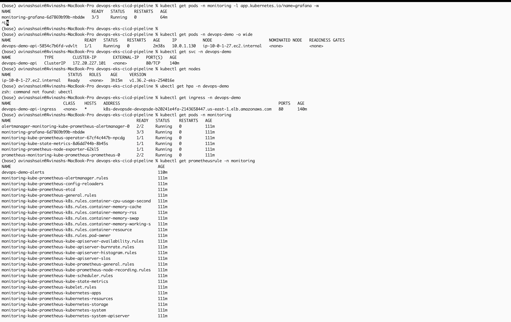
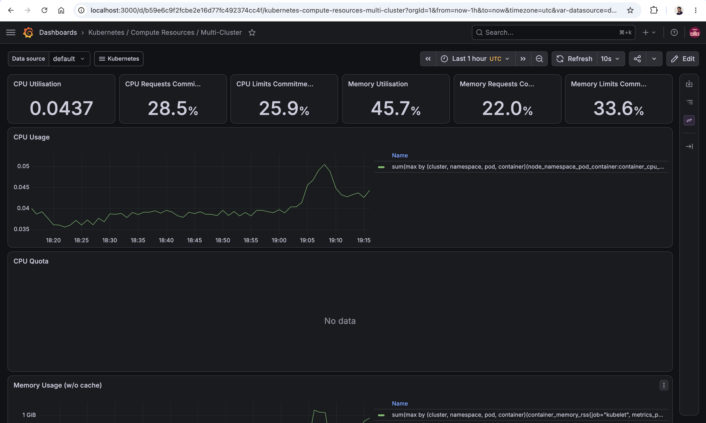

# devops-eks-cicd-pipeline

End-to-end DevOps pipeline: a Node.js API, Dockerized, deployed to AWS EKS,
provisioned with Terraform, orchestrated by Jenkins (local, exposed via
ngrok), monitored with Prometheus/Grafana, and reachable externally through
the AWS Load Balancer Controller + an ALB Ingress.

This README documents the **actual working setup**, including every real
issue hit along the way and its fix — not just the happy path.

**Git repo name:** `devops-eks-cicd-pipeline`

---

## Table of Contents
1. [Architecture](#architecture)
2. [Repo layout](#repo-layout)
3. [Prerequisites](#prerequisites)
4. [Step 1 — Provision AWS infrastructure with Terraform](#step-1)
5. [Step 2 — Point kubectl at the cluster](#step-2)
6. [Step 3 — Run Jenkins locally + expose via ngrok](#step-3)
7. [Step 4 — Configure the Jenkins job](#step-4)
8. [Step 5 — Trigger the pipeline](#step-5)
9. [Step 6 — Install the AWS Load Balancer Controller (IAM + Helm)](#step-6)
10. [Step 7 — Verify the app is reachable via ALB](#step-7)
11. [Step 8 — Install Prometheus + Grafana](#step-8)
12. [Step 9 — Access Grafana & Prometheus safely](#step-9)
13. [Troubleshooting — real issues hit in this project](#troubleshooting)
14. [Teardown](#teardown)
15. [Screenshots](#screenshots)

---

## Architecture

```
GitHub push
   │  (webhook via ngrok)
   ▼
Jenkins (local, Docker)
   │  npm test → docker buildx build --platform linux/amd64 → push to ECR
   ▼
AWS ECR  ──────────────────────────────►  AWS EKS (devops-eks-cicd-dev-eks)
                                              │
                                     ┌────────┴─────────┐
                                     │  devops-demo ns   │
                                     │  Deployment (1)   │──HPA (1-4)
                                     │  Service (ClusterIP)
                                     │  Ingress (ALB)     │
                                     └────────┬──────────┘
                                              │
                                    AWS ALB (internet-facing)
                                              │
                                          Your browser

                                     ┌───────────────────┐
                                     │  monitoring ns     │
                                     │  Prometheus        │
                                     │  Grafana           │
                                     │  Alertmanager      │
                                     └───────────────────┘
```

## Repo layout

```
devops-eks-cicd-pipeline/
├── app/                    # Node.js/Express Task API (real, tested)
├── terraform/
│   ├── modules/{vpc,eks,ecr}/
│   └── environments/dev/
├── jenkins/
│   ├── Jenkinsfile
│   └── setup-ngrok.md
├── k8s/                    # namespace, deployment, service, hpa, ingress
├── monitoring/             # Prometheus/Grafana Helm values + alert rules
├── scripts/                # bootstrap-backend.sh, setup-budget-alert.sh, teardown.sh
└── docs/screenshots/       # put your Grafana/Prometheus/Jenkins screenshots here
```

---

## Prerequisites

```bash
brew install kubectl awscli helm eksctl ngrok/ngrok/ngrok
# Docker Desktop: https://www.docker.com/products/docker-desktop/
aws configure   # needs an IAM user/role with EKS, EC2, IAM, ECR, ELB permissions
```

<a name="step-1"></a>
## Step 1 — Provision AWS infrastructure with Terraform

```bash
# One-time: create the S3 + DynamoDB backend (can't be created by Terraform itself)
./scripts chmod +x bootstrap-backend.sh
./scripts/bootstrap-backend.sh <your-unique-bucket-name> us-east-1
# Paste that bucket name into terraform/environments/dev/backend.tf

cd terraform/environments/dev
terraform init
terraform plan
terraform apply
```

Expected output includes:
```
vpc_id = "vpc-xxxxxxxxxxxxxxxxx"
ecr_repository_url = "<ACCOUNT_ID>.dkr.ecr.us-east-1.amazonaws.com/devops-eks-cicd-dev-app"
eks_cluster_name = "devops-eks-cicd-dev-eks"
configure_kubectl = "aws eks update-kubeconfig --region us-east-1 --name devops-eks-cicd-dev-eks"
```
Keep these three values — you'll reuse the VPC ID and cluster name repeatedly below.

<a name="step-2"></a>
## Step 2 — Point kubectl at the cluster

```bash
aws eks update-kubeconfig --region us-east-1 --name devops-eks-cicd-dev-eks
kubectl config current-context   # should print the devops-eks-cicd-dev-eks ARN
kubectl get nodes                # should show your Spot t3.medium node, Ready
```

> **Gotcha hit in this project:** if you have other EKS/kind/minikube contexts on
> your machine, `kubectl` can silently be pointed at the wrong cluster. Always
> confirm `kubectl config current-context` before debugging "nothing shows up."

<a name="step-3"></a>
## Step 3 — Run Jenkins locally + expose via ngrok

```bash
docker run -d --name jenkins -p 8080:8080 -p 50000:50000 \
  -v jenkins_home:/var/jenkins_home \
  -v /var/run/docker.sock:/var/run/docker.sock \
  jenkins/jenkins:lts

docker exec jenkins cat /var/jenkins_home/secrets/initialAdminPassword
```
Open `http://localhost:8080`, paste the password, install suggested plugins,
then add: **Docker Pipeline**, **Amazon ECR**, **Pipeline: AWS Steps**, **AWS Credentials**.

Give the Jenkins container the tools it needs to run the pipeline's shell steps:
```bash
docker exec -u root -it jenkins bash
apt-get update && apt-get install -y docker.io awscli
curl -LO "https://dl.k8s.io/release/v1.29.0/bin/linux/amd64/kubectl"
mv kubectl /usr/local/bin/ && chmod +x /usr/local/bin/kubectl
exit
docker restart jenkins
```

Expose Jenkins to GitHub:
```bash
ngrok config add-authtoken <YOUR_NGROK_TOKEN>
ngrok http 8080
```
Copy the printed `https://xxxx.ngrok-free.app` URL. Full walkthrough: `jenkins/setup-ngrok.md`.

In GitHub: **Settings → Webhooks → Add webhook**
- Payload URL: `https://xxxx.ngrok-free.app/github-webhook/` (trailing slash required)
- Content type: `application/json`
- Events: "Just the push event"

> **Note:** the free ngrok URL changes every time you restart the tunnel — you'll
> need to update the GitHub webhook URL each time unless you're on a paid ngrok plan.

<a name="step-4"></a>
## Step 4 — Configure the Jenkins job

New Item → Pipeline → script path `jenkins/Jenkinsfile` → check
**"GitHub hook trigger for GITScm polling"** under Build Triggers.

Credentials needed (Manage Jenkins → Credentials):
- Secret text, ID `ecr-repo-url` → your ECR URL from Terraform output
- AWS access key/secret with ECR push + EKS access (via AWS Credentials plugin)

> **Gotcha hit in this project:** `npm ci` failed with `EACCES` because
> Jenkins and your regular shell had run npm as different users, corrupting
> the shared `~/.npm` cache. Fixed by giving Jenkins its own isolated cache:
> `npm ci --cache .npm-cache` (already in the Jenkinsfile below).

<a name="step-5"></a>
## Step 5 — Trigger the pipeline

```bash
git add . && git commit -m "trigger pipeline" && git push
```

Current working `jenkins/Jenkinsfile` stages: Checkout → Install & Unit Test →
Build & Push Docker Image → Deploy to EKS → Verify Rollout.

> **Gotcha hit in this project:** the first deploy timed out at "Verify
> Rollout" (`0 of 1 updated replicas are available`). Root cause: building on
> an Apple Silicon Mac defaults to `arm64`, but the EKS nodes are `amd64`.
> Fixed with `docker buildx build --platform linux/amd64 ... --push`
> (already in the Jenkinsfile below) instead of a plain `docker build` + separate push.

> **Also fixed:** an earlier version had duplicate build/push stages and
> passed the `$ECR_REPO` secret through double-quoted Groovy strings
> (`sh "..."`), which triggers a "secret passed via Groovy String
> interpolation" warning. Fixed by switching to single-quoted heredocs
> (`sh '''...'''`) so the *shell*, not Groovy, expands the variables.

<a name="step-6"></a>
## Step 6 — Install the AWS Load Balancer Controller (IAM + Helm)

EKS does **not** ship this controller by default — without it, any
`Ingress` object just sits with a blank `ADDRESS` forever, no matter how
long you wait.

**1. IAM policy** (use the `main` branch policy, not an older tag — see gotcha below):
```bash
curl -o iam-policy-latest.json https://raw.githubusercontent.com/kubernetes-sigs/aws-load-balancer-controller/main/docs/install/iam_policy.json

aws iam create-policy \
  --policy-name AWSLoadBalancerControllerIAMPolicy \
  --policy-document file://iam-policy-latest.json
```

**2. IAM role bound to a Kubernetes service account (IRSA)**
```bash
eksctl utils associate-iam-oidc-provider \
  --region us-east-1 \
  --cluster devops-eks-cicd-dev-eks \
  --approve

eksctl create iamserviceaccount \
  --cluster devops-eks-cicd-dev-eks \
  --namespace kube-system \
  --name aws-load-balancer-controller \
  --role-name AmazonEKSLoadBalancerControllerRole \
  --attach-policy-arn arn:aws:iam::<ACCOUNT_ID>:policy/AWSLoadBalancerControllerIAMPolicy \
  --approve \
  --region us-east-1
```

**3. Install via Helm — pass the VPC ID explicitly**
```bash
helm repo add eks https://aws.github.io/eks-charts
helm repo update

helm install aws-load-balancer-controller eks/aws-load-balancer-controller \
  -n kube-system \
  --set clusterName=devops-eks-cicd-dev-eks \
  --set serviceAccount.create=false \
  --set serviceAccount.name=aws-load-balancer-controller \
  --set region=us-east-1 \
  --set vpcId=<YOUR_VPC_ID_FROM_TERRAFORM_OUTPUT>
```

> **Gotcha hit in this project #1 — IMDS lookup failure:**
> ```
> unable to initialize AWS cloud: failed to get VPC ID: ... context deadline exceeded
> ```
> The controller pod couldn't reach EC2 instance metadata to auto-discover
> the VPC. Fixed by passing `--set vpcId=...` explicitly (above) instead of
> relying on auto-detection.

> **Gotcha hit in this project #2 — missing IAM action:**
> ```
> AccessDenied: ... not authorized to perform: elasticloadbalancing:DescribeListenerAttributes
> ```
> The controller (`v3.5.0`) is newer than the IAM policy pinned to the
> `v2.7.2` docs tag, which is missing some newer actions. Fixed by
> re-pulling the policy from the `main` branch and updating the existing
> policy in place:
> ```bash
> aws iam list-policy-versions --policy-arn arn:aws:iam::<ACCOUNT_ID>:policy/AWSLoadBalancerControllerIAMPolicy
> # delete the oldest non-default version if you're at the 5-version limit:
> aws iam delete-policy-version --policy-arn arn:aws:iam::<ACCOUNT_ID>:policy/AWSLoadBalancerControllerIAMPolicy --version-id <NON_DEFAULT_VERSION_ID>
>
> aws iam create-policy-version \
>   --policy-arn arn:aws:iam::<ACCOUNT_ID>:policy/AWSLoadBalancerControllerIAMPolicy \
>   --policy-document file://iam-policy-latest.json \
>   --set-as-default
> ```
> No pod restart needed — the role picks up new permissions immediately,
> and the controller's reconciler retries automatically every ~20s.

**Verify:**
```bash
kubectl get pods -n kube-system -l app.kubernetes.io/name=aws-load-balancer-controller
kubectl logs -n kube-system -l app.kubernetes.io/name=aws-load-balancer-controller --tail=20
```
Both pods `1/1 Running`, logs show no more `Reconciler error` lines.

<a name="step-7"></a>
## Step 7 — Verify the app is reachable via ALB

```bash
kubectl get ingress -n devops-demo
```
Wait for the `ADDRESS` column to populate (1-3 min after the controller is healthy), then:
```bash
curl http://<ALB_ADDRESS>/health
curl http://<ALB_ADDRESS>/api/tasks
```
Or paste the URL straight into your browser — plain GETs render as JSON directly.


*`kubectl get ingress -n devops-demo` with a populated ADDRESS (ALB DNS name).*

<a name="step-8"></a>
## Step 8 — Install Prometheus + Grafana

```bash
helm repo add prometheus-community https://prometheus-community.github.io/helm-charts
helm install monitoring prometheus-community/kube-prometheus-stack \
  -n monitoring --create-namespace -f monitoring/prometheus-values.yaml
kubectl apply -f monitoring/alerts.yaml
```

**Verify:**
```bash
kubectl get pods -n monitoring
```
All pods should be `Running` (Grafana `3/3`, Prometheus `2/2`, Alertmanager `2/2`, others `1/1`).

<a name="step-9"></a>
## Step 9 — Access Grafana & Prometheus safely

> **Gotcha hit in this project — wrong container entirely:** `localhost:3000`
> and `localhost:9090` can be silently hijacked by an unrelated, older,
> standalone `docker run grafana/grafana` / `prom/prometheus` container
> already bound to those ports on your Mac. Every "data source unreachable"
> and "login failed" error in this project traced back to configuring the
> **wrong Grafana** — a local container with no relationship to the cluster.
> **Always check first:**
> ```bash
> docker ps | grep -E "grafana|prometheus"
> lsof -i :3000
> lsof -i :9090
> ```
> Stop any unrelated local containers before port-forwarding:
> ```bash
> docker stop grafana prometheus   # only if these are stray local containers, not your project's
> ```

**Port-forward to the real, EKS-hosted Grafana:**
```bash
kubectl port-forward -n monitoring svc/monitoring-grafana 3000:80
```
Get the admin password:
```bash
kubectl get secret --namespace monitoring monitoring-grafana -o jsonpath="{.data.admin-password}" | base64 --decode; echo
```
Open `http://localhost:3000`, log in as `admin` with that password.

> **If login still fails,** reset it directly (note: newer Grafana images
> use `grafana cli`, not the old standalone `grafana-cli` binary):
> ```bash
> kubectl exec -n monitoring -it $(kubectl get pod -n monitoring -l app.kubernetes.io/name=grafana -o jsonpath="{.items[0].metadata.name}") -c grafana -- grafana cli admin reset-admin-password newpassword123
> ```
> Or, more reliably, set it via Helm directly:
> ```bash
> helm upgrade monitoring prometheus-community/kube-prometheus-stack \
>   -n monitoring -f monitoring/prometheus-values.yaml \
>   --set grafana.adminPassword=newpassword123
> ```

**Add the Prometheus data source (Connections → Data sources → Add data source → Prometheus):**
```
http://monitoring-kube-prometheus-prometheus.monitoring:9090
```
Click **Save & test** — should say "Successfully queried the Prometheus API."

> **Gotcha hit in this project:** using `localhost:9090` here fails with
> `connection refused` — Grafana's *backend pod* has no route to your Mac's
> localhost. The URL must be the Prometheus **Service's cluster-DNS name**
> (`<service-name>.<namespace>:<port>`), confirmed via:
> ```bash
> kubectl get svc -n monitoring
> ```

**Port-forward Prometheus directly (optional, for its own UI):**
```bash
kubectl port-forward -n monitoring svc/monitoring-kube-prometheus-prometheus 9090:9090
```
Open `http://localhost:9090`, type `up` in the query box, click **Execute**.
Check **Status → Targets** for the full scrape target list.


*Grafana's Kubernetes / Compute Resources / Multi-Cluster dashboard, populated.*


*Still needed: a screenshot of Prometheus's own UI (`localhost:9090` → Status → Targets), showing UP targets.*

---

<a name="troubleshooting"></a>
## Troubleshooting — quick reference

| Symptom | Cause | Fix |
|---|---|---|
| `npm ci` → `EACCES` on `~/.npm` | Cache corrupted by mixed root/user npm runs | `npm ci --cache .npm-cache` (scoped to workspace) |
| Rollout times out, `0 of 1 updated replicas available` | Image built for `arm64` on Apple Silicon, node is `amd64` | `docker buildx build --platform linux/amd64 --push` |
| Groovy "secret passed via String interpolation" warning | `sh "...${SECRET}..."` (double-quoted) | Use `sh '''...$SECRET...'''` (single-quoted, shell-expanded) |
| Ingress `ADDRESS` stays blank forever | AWS Load Balancer Controller not installed | Install via IAM policy + IRSA + Helm (Step 6) |
| Controller crash-loops: `failed to get VPC ID` | Pod can't reach IMDS | `--set vpcId=<VPC_ID>` on Helm install |
| Controller `AccessDenied: DescribeListenerAttributes` | IAM policy older than controller version | Re-pull policy from `main` branch, update policy in place |
| Grafana data source: `connection refused` on `localhost:9090` | Grafana pod has no route to your Mac's localhost | Use `<service>.<namespace>:<port>` cluster-DNS name |
| Grafana data source: DNS `no such host` | Wrong service name guessed | `kubectl get svc -n monitoring`, use the exact name |
| Grafana "no data" / can't log in with known password | A **different, stray local Docker container** is squatting on port 3000/9090 | `docker ps`, `lsof -i :3000`, stop the unrelated container, re-port-forward |
| `grafana-cli: executable file not found` | Newer Grafana image renamed the binary | Use `grafana cli admin reset-admin-password ...`, or reset via Helm `--set grafana.adminPassword=...` |
| `kubectl` seems to show nothing / wrong cluster | Multiple contexts (EKS, kind, minikube) on the same machine | `kubectl config current-context`, `aws eks update-kubeconfig` again if wrong |

---

<a name="teardown"></a>
## Teardown (run at the end of every session)

```bash
kubectl delete -f k8s/ --ignore-not-found=true
helm uninstall monitoring -n monitoring
helm uninstall aws-load-balancer-controller -n kube-system
cd terraform/environments/dev
terraform destroy -auto-approve
```
Or simply:
```bash
./scripts chmod +x teardown.sh
./scripts/teardown.sh
```
This is the single biggest cost lever — an idle EKS cluster + NAT gateway
bills continuously whether or not you're using it.

---

<a name="screenshots"></a>
## Screenshots

Save your captures into `docs/screenshots/` using these filenames so they
render automatically in the sections above:

| File | What to capture | Status |
|---|---|---|
| `docs/screenshots/ingress-address.png` | `kubectl get ingress -n devops-demo` showing a populated ADDRESS | ✅ |
| `docs/screenshots/grafana-dashboard.png` | A populated Grafana dashboard (Kubernetes / Compute Resources) | ✅ |
| `docs/screenshots/prometheus-targets.png` | Prometheus Status → Targets, showing UP targets | ❌ still needed — capture from Prometheus's own UI (Step 9), not Grafana's Prometheus dashboard |
| `docs/screenshots/jenkins-pipeline-success.png` | A green, "Finished: SUCCESS" Jenkins build | ✅ (job overview page; a build-detail page with stage view would be even better) |
| `docs/screenshots/app-response.png` | Browser or `curl` output of `/api/tasks` via the ALB URL | ✅ |
